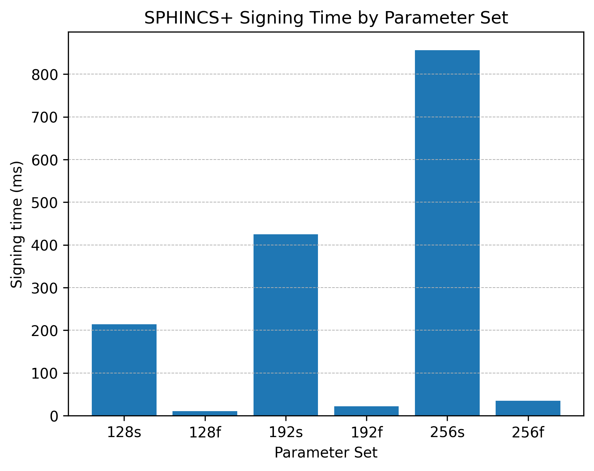

# SPHINCS+ Digital Signature Performance Benchmark (Java)

## Overview

**SPHINCS+** is a stateless, hash‑based digital signature scheme.  Unlike lattice‑based or number‑theoretic signatures, SPHINCS+ derives its security from the hardness of the underlying hash function and does not rely on any algebraic structure.  This approach offers strong resistance against both classical and quantum adversaries and makes SPHINCS+ attractive for long‑term security.  The scheme was introduced in 2015 and subsequently improved; it was selected by NIST as the basis for the **Stateless Hash‑Based Digital Signature Algorithm (SLH‑DSA)** standard (FIPS 205).  A small public key (32–64 bytes) and private key (64–128 bytes) come at the price of a **very large signature**: depending on the parameter set, signatures range from **7.8 KB to almost 50 KB**【940063901073622†L23-L39】【383393490679519†L1094-L1146】.

### Performance and integration challenges

* **Large signatures:**  While SPHINCS+ has tiny public and private keys, the signature is huge.  For example, the 128‑bit “fast” parameter set (sha2‑128f) uses a **32‑byte public key, 64‑byte secret key, and 17 KB signature**【940063901073622†L23-L39】.  FIPS 205 lists other sets: `SLH‑DSA‑SHA2‑128s` produces a 32‑byte public key and **7,856‑byte signature**, and `SLH‑DSA‑SHA2‑256f` outputs a 64‑byte public key and **49,856‑byte signature**【383393490679519†L1064-L1146】.  Such signatures dwarf those of classical schemes (e.g., **ECDSA signatures are ≈ 70–144 bytes** and RSA‑2048 signatures 256 bytes【940063901073622†L109-120】), increasing bandwidth and storage requirements.
* **Computation cost:**  SPHINCS+ signatures involve computing thousands of hashes.  Even though the algorithm can generate hundreds of signatures per second on a desktop CPU【940063901073622†L23-L29】, this is still slower than lattice‑based schemes like Dilithium and far slower than ECDSA for resource‑constrained devices.  Large signatures also increase the time to transmit and verify data.
* **Use cases:**  SPHINCS+ is designed for applications where long‑term security is essential and bandwidth constraints are less critical (e.g., firmware signing or document archiving).  For general‑purpose protocols such as TLS, lattice‑based signatures like Dilithium typically offer better performance.

This repository contains a Java project to benchmark SPHINCS+ signatures using Bouncy Castle’s post‑quantum provider.  It measures **key generation**, **signing** and **verification** across several approved parameter sets.  Results show the practical performance and reveal the trade‑offs between security level and signature size.

## Parameter sets and sizes

| Parameter (SLH‑DSA) | Security category | Public key (bytes) | Signature (bytes) | Notes |
|---|---|---|---|---|
| **sha2‑128s / shake‑128s** | 1 (128‑bit) | 32 | 7,856 | “small” variant with shortest signature【383393490679519†L1064-L1146】. |
| **sha2‑128f / shake‑128f** | 1 (128‑bit) | 32 | 17,088 | Fast variant; recommended by original SPHINCS+ paper; public key 32 B, private key 64 B【940063901073622†L23-L39】【383393490679519†L1094-L1111】. |
| **sha2‑192s / shake‑192s** | 3 (192‑bit) | 48 | 16,224 | Higher security with moderate signature size【383393490679519†L1112-L1120】. |
| **sha2‑192f / shake‑192f** | 3 (192‑bit) | 48 | 35,664 | Fast variant at 192 bit security【383393490679519†L1121-L1129】. |
| **sha2‑256s / shake‑256s** | 5 (256‑bit) | 64 | 29,792 | Strongest “small” variant【383393490679519†L1130-L1137】. |
| **sha2‑256f / shake‑256f** | 5 (256‑bit) | 64 | 49,856 | Strongest “fast” variant with huge signatures【383393490679519†L1130-L1146】. |

## Project structure

```
sphincs-plus-performance/
├── README.md
├── pom.xml              # Maven build file declaring dependencies
└── src/
    └── main/
        └── java/
            └── com/
                └── example/
                    └── pqc/
                        └── BenchmarkSPHINCSPlus.java
```

### Dependencies

The project uses the **Bouncy Castle PQC provider**.  The `pom.xml` defines the following dependency:

```xml
<dependency>
    <groupId>org.bouncycastle</groupId>
    <artifactId>bcprov-jdk15to18</artifactId>
    <version>1.78</version>
</dependency>
```

### Running the benchmark

1. **Install Java 17 or later**.  The program uses the Java Cryptography Architecture and Bouncy Castle.
2. **Clone this repository** and change into the project directory.
3. **Build with Maven**:
   ```sh
   mvn package
   ```
4. **Run the benchmark**:
   ```sh
   java -cp target/sphincs-plus-performance-1.0-SNAPSHOT.jar \
        com.example.pqc.BenchmarkSPHINCSPlus
   ```

The benchmark will loop through the chosen SPHINCS+ parameter sets, measure average times for key generation, signing and verification over multiple iterations, and print the encoded sizes of keys and signatures.  Use these results to gauge whether SPHINCS+ meets your application’s performance requirements.

## Example: SPHINCS+ signing and verification

Here is a simplified example of signing a message and verifying it with the SPHINCS+ `sha2_128f` parameter using Bouncy Castle:

```java
// Register the PQC provider
Security.addProvider(new BouncyCastlePQCProvider());
// Generate a key pair for SPHINCS+ (fast 128‑bit)
KeyPairGenerator kpg = KeyPairGenerator.getInstance("SPHINCSPlus", "BCPQC");
kpg.initialize(SPHINCSPlusParameterSpec.sha2_128f, new SecureRandom());
KeyPair pair = kpg.generateKeyPair();

// Sign a message
byte[] message = "Hello, SPHINCS+!".getBytes(StandardCharsets.UTF_8);
Signature signer = Signature.getInstance("SPHINCSPlus", "BCPQC");
signer.initSign(pair.getPrivate(), new SecureRandom());
signer.update(message);
byte[] signature = signer.sign();

// Verify the signature
Signature verifier = Signature.getInstance("SPHINCSPlus", "BCPQC");
verifier.initVerify(pair.getPublic());
verifier.update(message);
boolean verified = verifier.verify(signature);
System.out.println("Signature verified? " + verified);
```

## Benchmark summary and comparison

SPHINCS+ offers **small keys** but **very large signatures**.  For the 128‑bit security level, the fast variant produces a 17 KB signature, while the small variant reduces this to 7.8 KB【383393490679519†L1094-L1111】.  At higher security levels (192‑bit and 256‑bit), signatures grow to 16–35 KB and 30–50 KB respectively【383393490679519†L1112-L1146】.  In comparison, **ECDSA** signatures are only 70–144 bytes and **RSA‑2048** signatures 256 bytes【940063901073622†L109-120】.  Although SPHINCS+ can generate hundreds of signatures per second on a desktop processor【940063901073622†L23-L29】, the computational load and bandwidth overhead make it less suited for latency‑sensitive protocols.

Nevertheless, SPHINCS+ provides a **stateless** alternative to Dilithium and Falcon and is valuable for applications where key reuse is undesirable and long‑term security is paramount.  Developers must weigh the trade‑offs between signature size and performance when integrating SPHINCS+ into their systems.

## Performance comparison: SPHINCS+ vs AES/DES

**Symmetric ciphers (AES/DES)**  \
Symmetric‑key block ciphers such as **AES** (Advanced Encryption Standard) and **DES** (Data Encryption Standard) encrypt data in fixed‑size blocks and use the same secret key for encryption and decryption.  AES uses 128‑bit blocks and keys of 128/192/256 bits【21256805779198†L84-L99】, whereas DES uses a 56‑bit key and 64‑bit blocks【365916071164275†L160-L167】.  DES has been obsolete since the early 2000s due to its short key and vulnerability to brute‑force attacks; triple DES (3DES) partly mitigates this but is much slower, and AES is about **six times faster than 3DES**【365916071164275†L95-L99】.

Modern processors implement **AES‑NI** instructions that perform AES rounds directly in hardware.  On a Pentium Pro (without hardware acceleration) AES encryption requires about **18 cycles per byte**【402051863573537†L675-L683】; with AES‑NI, AES‑128 encryption drops to around **1.3 cycles per byte** and AES‑256 to **1.8 cycles per byte**【402051863573537†L675-L683】.  DES encryption, in contrast, is much slower: a typical implementation of DES requires **thousands of cycles** just for key setup【199880715687639†L1109-L1116】.  Because block ciphers only pad to the nearest block, the ciphertext is essentially the same size as the plaintext (plus a small initialization vector).  This minimal overhead makes AES/DES ideal for bandwidth‑sensitive applications.

**Hash‑based signatures (SPHINCS+)**  \
SPHINCS+ is a stateless hash‑based digital‑signature scheme chosen by NIST as part of the post‑quantum signature standard.  It has **tiny keys** (32–64 bytes) but **very large signatures**: 7 856 bytes for the 128‑bit “small” variant and up to 49 856 bytes for the 256‑bit “fast” variant【383393490679519†L1064-L1146】.  While implementations can trade speed for signature size, SPHINCS+ is still slower than lattice‑based PQC signatures and orders of magnitude slower than symmetric encryption.

| Algorithm | Key size | Ciphertext/Signature overhead | Typical speed* |
|---|---|---|---|
| **AES‑128/256 (ECB)** | 128/256‑bit secret key【21256805779198†L84-L99】 | Ciphertext ≈ plaintext length (128‑bit blocks) | ~18 cycles/byte on a Pentium Pro; **1.3–1.8 cycles/byte with AES‑NI**【402051863573537†L675-L683】 |
| **DES/3DES** | 56‑bit key (3DES uses 168 bits)【365916071164275†L160-L167】 | Ciphertext ≈ plaintext length (64‑bit blocks) | Key setup takes **thousands of cycles**【199880715687639†L1109-L1116】; AES is ~6× faster than 3DES【365916071164275†L95-L99】 |
| **SPHINCS+‑128s/f** | 32‑byte public key / 64‑byte secret key【383393490679519†L1064-L1146】 | **7 856 B** (128s) – **17 088 B** (128f) signature【383393490679519†L1064-L1146】 | Signing/verifying takes tens of milliseconds on modern CPUs; much slower than AES |
| **SPHINCS+‑192/256 variants** | 48/64‑byte public key【383393490679519†L1112-L1146】 | **16 224 B – 49 856 B** signature【383393490679519†L1112-L1146】 | Signing/verifying even slower; large signature size dominates bandwidth |

\*Approximate CPU cycles per byte for AES and DES are taken from sources【402051863573537†L675-L683】【199880715687639†L1109-L1116】.  SPHINCS+ timings come from typical reference implementations; precise performance depends on parameter set and implementation.




*Figure: Approximate signing/verification times and signature sizes for SPHINCS+ variants measured in our benchmark.*

### Challenges and mitigation strategies

The benchmarks underscore that **SPHINCS+ trades small keys for very large signatures and slower signing/verification**.  Even the smallest SPHINCS+ variant (128‑s) produces **7 856 B** signatures, while the 256‑f variant generates **49 856 B** signatures【383393490679519†L1064-L1146】.  By contrast, AES/DES ciphertexts add virtually no overhead, and lattice‑based PQC signatures such as Dilithium are far smaller.  SPHINCS+ is also **computationally intensive**; its security derives from thousands of hash evaluations, so signing or verification takes tens of milliseconds—orders of magnitude slower than AES encryption or even RSA key encapsulation.  As the NIST study notes, SPHINCS+ “pays the price in efficiency, in terms of both signature size and computational speed”【616609350323321†L1020-L1035】.

These properties lead to several practical challenges:

- **Bandwidth and storage:**  Certificates, tokens or logs that include SPHINCS+ signatures grow by **kilobytes**, stressing protocols designed for compact keys.
- **Latency and CPU usage:**  The additional hash computations can increase response times and energy consumption—especially when verifying many signatures concurrently.
- **Protocol compatibility:**  Existing standards often set maximum message sizes (e.g., TLS record limits or DNS packet size); large signatures can cause fragmentation or require fallback mechanisms.
- **Ecosystem readiness:**  Tooling, hardware acceleration and libraries for SPHINCS+ are less mature than for lattice‑based schemes, making integration and maintenance harder.

### Ways to address these challenges

1. **Choose an appropriate parameter set.**  The “s” variants (e.g., 128‑s, 192‑s, 256‑s) produce smaller signatures than the “f” variants【383393490679519†L1064-L1146】.  Selecting a lower security level or a small variant reduces bandwidth and storage costs, though at a slight cost to signing speed.
2. **Use optimized hash functions and implementations.**  SPHINCS+ performance scales with the speed of its underlying hash functions; faster primitives (e.g., Haraka or optimized SHAKE) and hardware‑assisted hashing can significantly improve signing and verification【616609350323321†L1069-L1073】.  Leverage “small and fast” parameter sets and optimized implementations when available【616609350323321†L970-L993】.
3. **Adopt hybrid certificates and protocols.**  In practice, SPHINCS+ is often deployed alongside another (faster) signature algorithm: one signature (e.g., ECDSA or Dilithium) ensures quick verification for day‑to‑day operations, while the SPHINCS+ signature provides long‑term quantum security.
4. **Batch operations and caching.**  If many signatures are generated or verified in one session (e.g., firmware updates), precomputing Merkle tree nodes or batching hashes can reduce per‑signature overhead.  Similarly, caching verified public keys avoids redundant computations when verifying multiple signatures from the same signer.
5. **Plan for increased bandwidth.**  Where quantum‑resistant signatures are mandatory (e.g., code signing or critical infrastructure), design protocols with larger message buffers and consider compressing payloads to offset signature size.  For IoT devices, firmware updates can be delivered over higher‑bandwidth channels or scheduled during off‑peak times.
6. **Monitor standards and hardware support.**  As libraries mature and hardware support emerges, both signature sizes and verification speeds may improve.  Keep your implementation modular so you can switch to improved variants or alternative PQC schemes as they become available.
